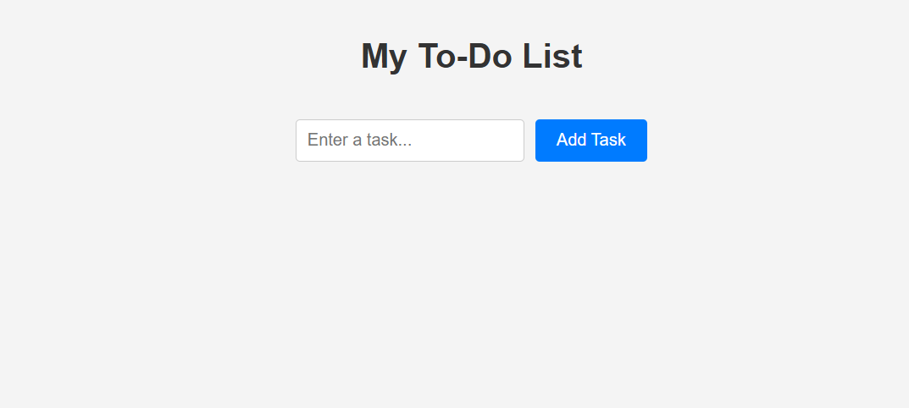
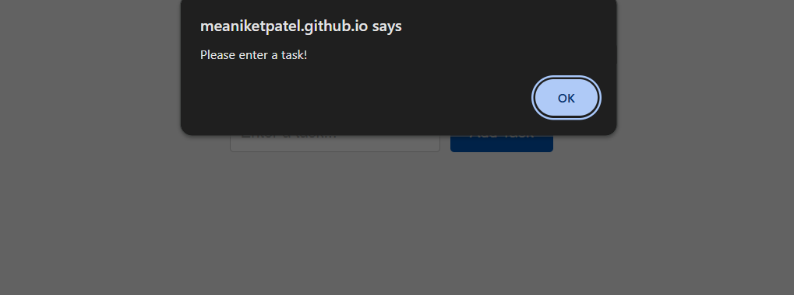

# To-Do List Application

A simple web application that allows users to add, delete, and persist tasks using JavaScript and localStorage.

## Features

- Add tasks via an input field and button.
- Delete individual tasks with a button next to each task.
- Persist tasks across page reloads using localStorage.
- Responsive design for mobile and desktop using plain CSS.
- Input validation to prevent empty tasks.

## Setup

1. Clone the repository:

   ```bash
   git clone https://github.com/meaniketpatel/todo-list.git
   ```

2. Open `index.html` in a web browser.

## Live Demo

View Demo : https://meaniketpatel.github.io/todo-list/

## What I Learned

- DOM manipulation and event handling (click and keypress).
- Persisting data with localStorage.
- Creating a responsive UI with plain CSS.

## Challenges Faced

- Ensuring the delete function updated the UI correctly was tricky. I solved it by clearing and re-rendering the task list.
- Making the design responsive required careful media query adjustments for small screens.

## Screenshots




